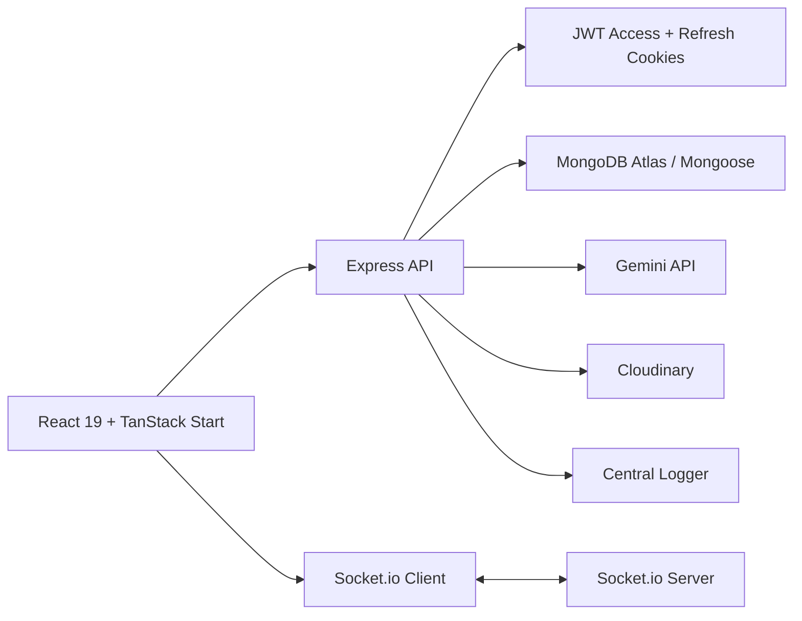

# SevakAI Volunteer Deployment

SevakAI is a role-based volunteer command center for large public events. The existing React/TanStack UI now runs against an Express 5 backend with MongoDB Atlas, JWT auth, Socket.io realtime updates, Cloudinary image storage, and Gemini-powered operational assistance.

The backend no longer contains an in-memory datastore. Startup fails immediately when the required runtime secrets are missing.

## Architecture



## Stack

- Frontend: React 19, TypeScript, TanStack Start, React Query, Tailwind CSS, Axios, Socket.io Client
- Backend: Express 5, Node.js, Mongoose, Zod validation, Helmet, CORS, Compression, Morgan, express-rate-limit
- Auth: JWT access token + refresh token cookies, bcryptjs hashing, account lockouts, password reset token flow
- Data: MongoDB Atlas via Mongoose models with indexes and references
- AI: Gemini API with retry, timeout, and deterministic fallback behavior
- Storage: Cloudinary image upload, replace, delete, and cleanup endpoints

## Folder Structure

```text
backend/
  app.js
  server.js
  config/
  controllers/
  middleware/
  models/
  routes/
  scripts/
  services/
  socket/
  tests/
  utils/
  validators/
src/
  components/
  hooks/
  lib/
    api/
    operations.ts
  routes/
```

## Environment

Create `.env` from `.env.example`.

Required at startup:

- `MONGODB_URI`
- `JWT_SECRET`
- `JWT_REFRESH_SECRET`
- `GEMINI_API_KEY`
- `CLIENT_URL`

Optional but supported:

- `PORT`
- `JWT_EXPIRES_IN`
- `JWT_REFRESH_EXPIRES_IN`
- `GEMINI_MODEL`
- `GEMINI_TIMEOUT_MS`
- `COOKIE_DOMAIN`
- `CLOUDINARY_CLOUD_NAME`
- `CLOUDINARY_API_KEY`
- `CLOUDINARY_API_SECRET`
- `RATE_LIMIT_WINDOW_MS`
- `RATE_LIMIT_MAX`
- `AUTH_RATE_LIMIT_MAX`
- `MAX_LOGIN_ATTEMPTS`
- `ACCOUNT_LOCK_MS`
- `DB_MAX_POOL_SIZE`
- `DB_MIN_POOL_SIZE`
- `DB_CONNECT_RETRIES`
- `DB_RETRY_DELAY_MS`
- `DB_SERVER_SELECTION_TIMEOUT_MS`
- `DB_SOCKET_TIMEOUT_MS`
- `DB_MAX_IDLE_TIME_MS`
- `VITE_API_BASE_URL`
- `VITE_SOCKET_URL`

## Local Setup

```bash
npm install
npm run migrate:db
npm run seed:db
npm run dev
```

This starts:

- Frontend on `http://localhost:3000`
- Backend on `http://localhost:4000`

The frontend proxies `/api` and `/socket.io` to the local backend during development.

## Scripts

```bash
npm run dev          # frontend + backend
npm run dev:client   # frontend only
npm run dev:server   # backend only
npm run build        # production frontend + nitro build
npm run preview      # preview frontend build
npm run start:server # start backend
npm run lint         # eslint
npm run test         # smoke tests when test env vars are provided
npm run seed:db      # seed MongoDB with demo operational data
npm run migrate:db   # sync indexes and backfill schema additions
npm run audit        # npm audit
```

## MongoDB Setup

1. Create a MongoDB Atlas cluster.
2. Create a database user with read/write access.
3. Add your deployment IPs or temporary development IPs to the Atlas network allowlist.
4. Copy the connection string into `MONGODB_URI`.
5. Run `npm run migrate:db`.
6. Run `npm run seed:db` if you want demo data and demo accounts.

Seeded demo accounts:

- `admin@sevakai.dev` / `Admin@123456`
- `manager@sevakai.dev` / `Manager@123456`
- `volunteer@sevakai.dev` / `Volunteer@123456`

## Cloudinary Setup

1. Create a Cloudinary account.
2. Set `CLOUDINARY_CLOUD_NAME`, `CLOUDINARY_API_KEY`, and `CLOUDINARY_API_SECRET`.
3. Use:
   - `POST /api/uploads/image`
   - `PUT /api/uploads/image`
   - `DELETE /api/uploads/image`
   - `POST /api/uploads/cleanup`

If Cloudinary env is not configured, upload endpoints return `503`.

## Gemini Setup

1. Create a Gemini API key.
2. Set `GEMINI_API_KEY`.
3. Optionally override `GEMINI_MODEL` and `GEMINI_TIMEOUT_MS`.

The assistant endpoint:

- retries transient `429/500/503`
- falls back to a deterministic operational summary when the provider is overloaded
- never returns raw provider errors to the client

## Database Collections

- `users`
- `profiles`
- `roles`
- `volunteers`
- `zoneManagers`
- `zones`
- `incidents`
- `assignments`
- `tasks`
- `attendance`
- `analytics`
- `forecasts`
- `notifications`
- `chats`
- `messages`
- `activityLogs`
- `systemLogs`
- `auditLogs`

## API Summary

Authentication:

- `POST /api/auth/register`
- `POST /api/auth/login`
- `POST /api/auth/forgot-password`
- `POST /api/auth/reset-password`
- `POST /api/auth/refresh`
- `GET /api/auth/me`
- `POST /api/auth/logout`

Dashboard and analytics:

- `GET /api/dashboard/snapshot`
- `GET /api/dashboard/overview`
- `GET /api/dashboard/map`
- `GET /api/analytics`
- `GET /api/reports/summary`

Volunteers and assignments:

- `GET /api/volunteers`
- `GET /api/volunteers/:volunteerId`
- `GET /api/assignments/:incidentId/recommendations`
- `POST /api/assignments/:incidentId/dispatch`

Incidents:

- `GET /api/incidents`
- `POST /api/incidents`
- `PATCH /api/incidents/:incidentId/status`
- `POST /api/incidents/:incidentId/resolve`
- `POST /api/incidents/sos`

Notifications, attendance, chat, AI, uploads:

- `GET /api/notifications`
- `PATCH /api/notifications/:notificationId/read`
- `GET /api/attendance/me`
- `POST /api/attendance/check-in`
- `GET /api/messages/chats`
- `GET /api/messages/chats/:chatId/messages`
- `POST /api/messages`
- `POST /api/gemini/assistant`
- `POST /api/uploads/image`
- `PUT /api/uploads/image`
- `DELETE /api/uploads/image`
- `POST /api/uploads/cleanup`

## Deployment

### Frontend on Vercel

1. Keep `vercel.json` as committed.
2. Set the build command to `npm run build`.
3. Set `VITE_API_BASE_URL` to the deployed backend origin if it differs from the frontend origin.
4. Set `VITE_SOCKET_URL` when Socket.io is on a separate origin.

### Backend on Railway

1. Keep `railway.json` as committed.
2. Use `npm run start:server` as the start command.
3. Set all required runtime env vars.
4. Set `CLIENT_URL` to the production frontend origin.
5. Run `npm run migrate:db`.
6. Run `npm run seed:db` only if you want demo data in that environment.

## Troubleshooting

`Invalid environment configuration`:

- One or more required env vars are missing or malformed.

`MongoDB connection attempt failed`:

- Verify the Atlas connection string, credentials, and allowlist.

`401 Session expired`:

- Confirm cookies are enabled and `CLIENT_URL` matches the frontend origin exactly.

`423 Account is temporarily locked`:

- Too many failed login attempts triggered the lockout window.

`Cloudinary is not configured`:

- Add the three Cloudinary env vars.

`Socket updates do not appear`:

- Verify `VITE_SOCKET_URL` for cross-origin deployments or rely on the Vite proxy locally.

## Verification

Current recommended verification flow:

```bash
npm install
npm run lint
npm run build
npm run migrate:db
npm run seed:db
npm run test
```

`npm run test` expects real runtime test env vars such as `TEST_ADMIN_EMAIL` and `TEST_ADMIN_PASSWORD`. If they are not provided, the smoke suite skips instead of guessing.
